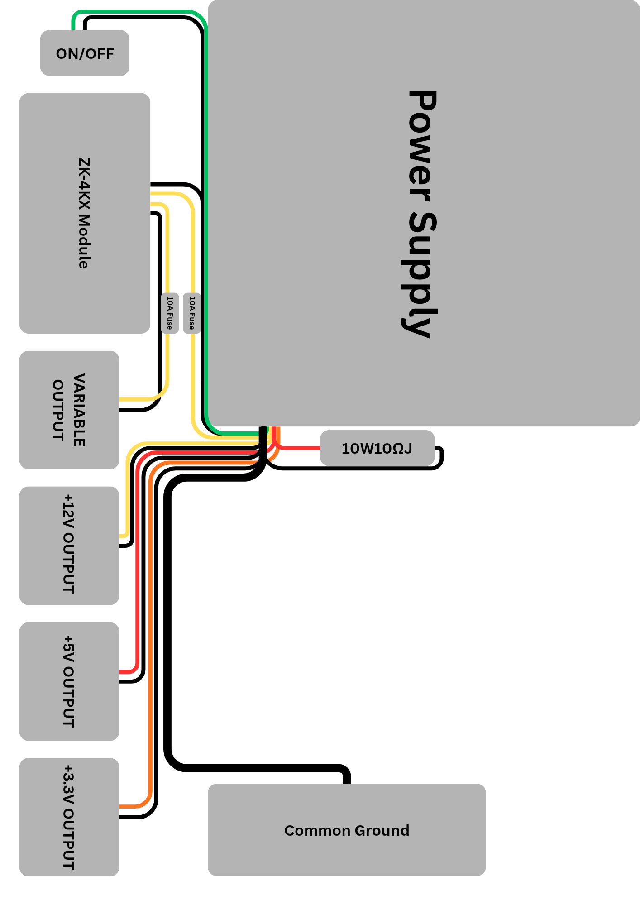

# DIY Bench Poweee Supply
This is my first hardware project. Im converting my old used pc power supply into a bench power supply using a ZK-4KX module. This tool will help me with my future electronic thingy (definitely)

## Key Feature 
* **Variable Voltage & Current using ZK-4KX module**
* **Includes a 10A Fuse and a 10W 10Ω dummy load to ensure the poweee supply stays stable and safe during use**
* **Giving a second life to the old poweee supply**

## The Design

## Bill of Materials
| Component | Qty | Price (Est.) | Link |
| :--- | :---: | :--- | :--- |
| **Used ATX PSU** | 1 | Already Have | - |
| **ZK-4KX Buck-Boost Module** | 1 | $5.50 | [Alibaba Link](https://www.alibaba.com/showroom/zk-4kx-buck-boost-converter.html) |
| **10W 10Ω Resistor (Load)** | 1 | $0.50 | [Alibaba Link](https://www.alibaba.com/showroom/10w-10-ohm-resistor.html) |
| **10A Fuse + Holder** | 2 | $2.00 | [Alibaba Link](https://www.alibaba.com/showroom/10a-fuse-holder.html) |
| **Binding Posts (Red/Black)** | 5 Pairs | $4.00 | [Alibaba Link](https://www.alibaba.com/showroom/binding-post-connector.html) |
| **TB-2506 Terminal Block** | 1 | $1.20 | [Alibaba Link](https://www.alibaba.com/showroom/tb-2506-terminal-block.html) |
| **On/Off Toggle Switch** | 1 | $0.80 | [Alibaba Link](https://www.alibaba.com/showroom/toggle-switch.html) |
| **Hookup Wires (18AWG)** | 1 Set | $2.00 | [Alibaba Link](https://www.alibaba.com/showroom/18awg-silicone-wire.html) |

**Total: ~$17.00USD**
*i know its look cheap, but in my country $17.00USD are not that cheap*ry
